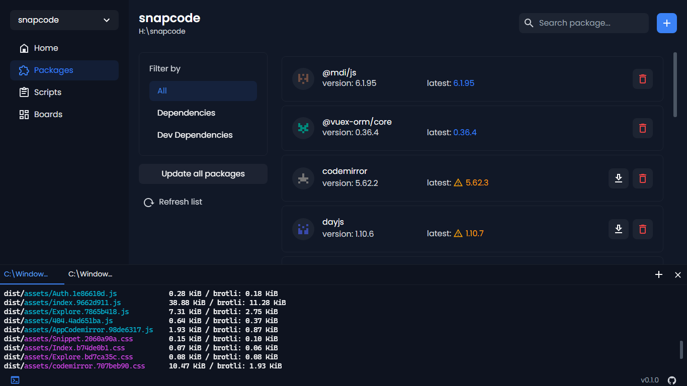

<p align="center">
  
  
</p>
<p align="center">
  <a href="https://www.producthunt.com/posts/projectile?utm_source=badge-featured&utm_medium=badge&utm_souce=badge-projectile" target="_blank">
    
  </a>
</p>

# Projectile

An app that will help you to manage your JavaScript projects with GUI

## Download
[Download](https://github.com/kholid060/projectile/releases/latest)

## Features
- Install or update your project dependencies
- Run your project scripts
- Kanban board
- Support monorepo

## Project setup
```
yarn install
```

### Compiles and hot-reloads for development
```
yarn watch
```

### Compiles app for debugging
```
yarn compile
```

### Lints and fixes files
```
yarn lint
```
